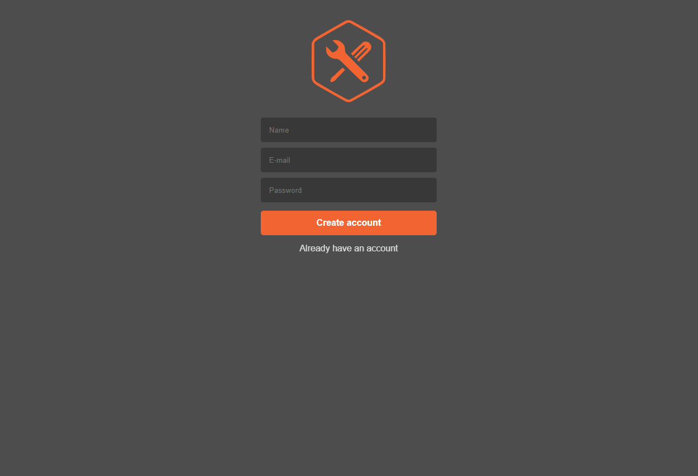

<h1 align="center">
  
</h1>

<h3 align="center">VUTTR - Very Useful Tools to Remember</h3>

Desafio Front-end da BossaBox

## 💻 Sobre o projeto

 VUTTR (Very Useful Tools to Remember) é uma api de repositório simples para gerenciar ferramentas com seus respectivos nomes, links, descrições e tags.

## Demo

 #### Tecnologias utilizadas

  -  [ReactJS](https://reactjs.org/)
  -  [Redux](https://redux.js.org/)
  -  [Redux-Saga](https://redux-saga.js.org/)
  -  [React Router v4](https://github.com/ReactTraining/react-router)
  -  [Axios](https://github.com/axios/axios)
  -  [History](https://www.npmjs.com/package/history)
  -  [Immer](https://github.com/immerjs/immer)
  -  [React-Toastify](https://fkhadra.github.io/react-toastify/)
  -  [styled-components](https://www.styled-components.com/)
  -  [React-Icons](https://react-icons.netlify.com/)
  -  [Reactotron](https://infinite.red/reactotron)

## 🔧 Instalando o projeto

Supondo que você já tenha Node.JS e Yarn instalados,

### Clone este repositório

#### `git clone https://github.com/gabrielrsp/vuttr-frontend.git`

### Instale as dependências

#### `yarn`

#### Execute a aplicação com o comando

#### `yarn start`

A aplicação irá executar na porta 3000
abra [http://localhost:3000](http://localhost:3000) para ver no browser

